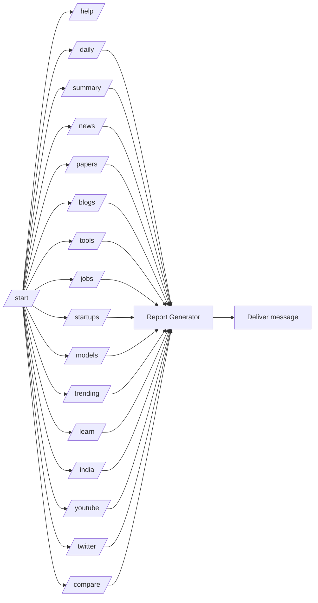
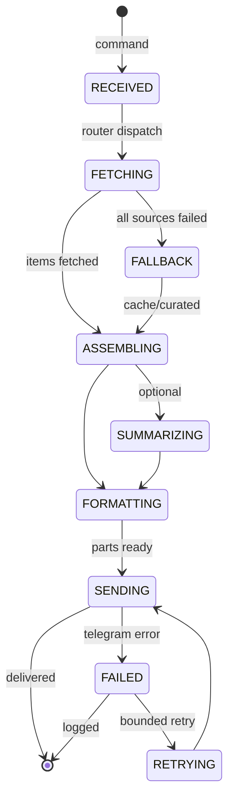

# AppFlow — AI Daily Telegram Bot: Application Flow

| Field | Value |
| --- | --- |
| Version | v0.1 |
| Last Updated | 2026-08-06 |
| Owner | PM / QA |
| Status | In Review |

---

## 1. Screen Inventory

Telegram chat surface; "screens" are command responses.

| SCR-### | Screen | Purpose | Entry Points | Exit Points | Auth |
| --- | --- | --- | --- | --- | --- |
| SCR-001 | Welcome (`/start`) | Intro + command list | `/start` | any command | Telegram |
| SCR-002 | Help (`/help`) | Command help | `/help` | any command | Telegram |
| SCR-003 | Daily Brief (`/daily`) | Main AI brief | `/daily`, scheduled | read/scroll | Telegram |
| SCR-004 | Short Summary (`/summary`) | Condensed brief | `/summary` | read/scroll | Telegram |
| SCR-005 | News (`/news`) | Global AI news | `/news` | read/scroll | Telegram |
| SCR-006 | Papers (`/papers`) | arXiv papers | `/papers` | read/scroll | Telegram |
| SCR-007 | Blogs (`/blogs`) | Blog updates | `/blogs` | read/scroll | Telegram |
| SCR-008 | Tools (`/tools`) | Trending tools | `/tools` | read/scroll | Telegram |
| SCR-009 | Jobs (`/jobs`) | AI jobs | `/jobs` | read/scroll | Telegram |
| SCR-010 | Startups (`/startups`) | Startup news | `/startups` | read/scroll | Telegram |
| SCR-011 | Models (`/models`) | Model releases | `/models` | read/scroll | Telegram |
| SCR-012 | Trending (`/trending`) | Community trends | `/trending` | read/scroll | Telegram |
| SCR-013 | Learn (`/learn`) | Learning resources | `/learn` | read/scroll | Telegram |
| SCR-014 | India (`/india`) | India AI news | `/india` | read/scroll | Telegram |
| SCR-015 | YouTube (`/youtube`) | AI YouTube updates | `/youtube` | read/scroll | Telegram |
| SCR-016 | Twitter (`/twitter`) | Curated X posts | `/twitter` | read/scroll | Telegram |
| SCR-017 | Compare (`/compare`) | Model comparison | `/compare` | read/scroll | Telegram |

## 2. Navigation Map

## 3. Detailed Flow per Journey

### Core loop: any content command

## 4. Empty / Loading / Error States

| Surface | Empty | Loading | Error |
| --- | --- | --- | --- |
| Any content command | Curated fallback content | "Generating…" typing indicator | Error message + log |
| Scheduled broadcast | Skipped with log | — | Retry with backoff |
| Cache | Empty → fetch live | — | — |

## 5. Edge Cases & Branching Logic

| IF condition | THEN route |
| --- | --- |
| All live sources fail | Serve cache → curated fallback |
| Some sources fail | Serve partial + cache for missing |
| Message > 4096 chars | Split into parts |
| Gemini unavailable | Skip summarization, keep digest |
| `TELEGRAM_CHAT_ID` unset + scheduled broadcast | Skip broadcast, log |
| Unknown command | Show `/help` |

## 6. Notifications & Re-engagement

| Trigger | Channel | Destination |
| --- | --- | --- |
| Scheduled interval | Telegram broadcast | configured chat |
| User command | Telegram reply | originating chat |

## 7. Cross-Platform Deltas

N/A — Telegram-only in v1.

## 8. Related Documents

| Document | Relationship |
| --- | --- |
| [PRD.md](../product/PRD.md) | Command requirements |
| [TechSpec.md](../technical/TechSpec.md) | Components |
| [Design.md](Design.md) | Message style |
| [Schema.md](../technical/Schema.md) | Cache keys |
| [ImplementationPlan.md](../project/ImplementationPlan.md) | Tasks |
| [Tracker.md](../project/Tracker.md) | Status |
| [Rules.md](../project/Rules.md) | Standards |
| [API.md](../technical/API.md) | Telegram API |
| [SecurityAndCompliance.md](../technical/SecurityAndCompliance.md) | Secrets |
| [Testing.md](../technical/Testing.md) | Command tests |
| [Deployment.md](../technical/Deployment.md) | Deploy |
| [Glossary.md](../reference/Glossary.md) | Vocabulary |
| [RiskRegister.md](../project/RiskRegister.md) | Risks |
