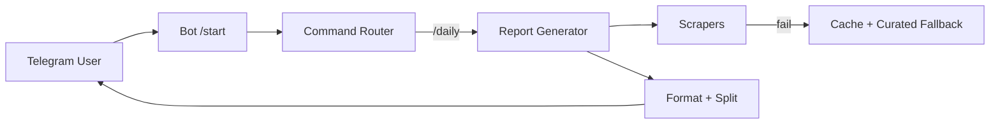

# PRD — AI Daily Telegram Bot: Aggregated AI/ML News Digest

| Field | Value |
| --- | --- |
| Version | v0.1 |
| Last Updated | 2026-08-06 |
| Owner | Product Manager |
| Status | In Review |

---

## 1. Executive Summary

The AI Daily Telegram Bot is an automated Telegram bot that aggregates, summarizes, and delivers daily AI/ML news digests from 16+ sources (GitHub trending, news RSS, Twitter/X, Indian news sources, arXiv papers, and AI model comparison sites). Users invoke commands like `/daily`, `/papers`, `/india`, and `/compare` to get curated content. The bot is reliability-first: if live sources fail it falls back to cached or curated content instead of crashing. Gemini optionally powers article summarization.

## 2. Problem Statement

- **User pain:** AI/ML news is scattered across Twitter/X, RSS feeds, arXiv, GitHub, and Indian outlets. Keeping up daily is overwhelming.
- **Evidence/context:** A single daily brief saves subscribers hours of manual scanning; no single aggregator covers global + India + papers + tools.
- **Cost of not solving it:** Users miss model releases, papers, and job opportunities; newsletter burnout.

## 3. Goals & Non-Goals

| Goal | Metric | Target |
| --- | --- | --- |
| Deliver daily digest on schedule | Broadcast success rate | ≥ 99% of scheduled broadcasts |
| Coverage of 16+ sources | Sources with non-empty content | ≥ 16 sources/day |
| Reliability under source failure | % of commands returning content | ≥ 95% (fallback to cache/curated) |
| Low cost | LLM usage (optional Gemini) | Optional; deterministic fallback free |

### Non-Goals (v1)
- Native multi-language digests (English only v1).
- Web dashboard / webhook APIs for third parties.
- Monetization / paid subscriptions.
- Archiving full article text (links only).

## 4. Target Users & Personas

| Persona | Role | Goals | Frustrations | Quote | Tech Comfort |
| --- | --- | --- | --- | --- | --- |
| Ravi — ML Engineer | Consumes daily AI news | Catch papers/models fast | Scattered sources | "One daily digest, please." | High |
| Ananya — AI Researcher | Tracks arXiv + Indian AI | Find relevant papers | Filtering noise | "Give me papers + India news." | Medium |
| Dev — Casual Enthusiast | Follows AI trends | Lightweight summary | Too much technical depth | "Short summary is enough." | Low |

## 5. User Stories

| ID | As a... | I want... | So that... | Priority | Acceptance Criteria |
| --- | --- | --- | --- | --- | --- |
| US-001 | Subscriber | `/daily` to produce the main brief | I get everything in one message | P0 | Brief generated from live/cache/curated |
| US-002 | Subscriber | `/papers` for latest arXiv | I track research | P1 | Paper list with titles/links |
| US-003 | India-focused user | `/india` coverage | I follow domestic AI news | P1 | India sources scraped |
| US-004 | Subscriber | scheduled auto-broadcast | digest arrives without asking | P1 | Interval broadcast works with `TELEGRAM_CHAT_ID` |
| US-005 | Subscriber | messages split automatically | no oversized-message crash | P0 | Long briefs split into parts |
| US-006 | User | graceful fallback when sources fail | I always get something | P0 | Cache/curated fallback served |
| US-007 | Subscriber | `/compare` model comparison | I compare AI models | P2 | Comparison content served |

## 6. Feature List

| ID | Epic | Feature | Description | Priority | Status |
| --- | --- | --- | --- | --- | --- |
| REQ-001 | Commands | Command router | Routes 17 commands (see ../design/AppFlow.md) | P0 | Done |
| REQ-002 | Scraping | 16+ scrapers (6 modules) | Live source fetching | P0 | Done |
| REQ-003 | Caching | diskcache cache manager | Fallback store + performance | P0 | Done |
| REQ-004 | Fallback | Curated fallback content | Serve when live fails | P0 | Done |
| REQ-005 | Summarization | Gemini summarizer (optional) | Condense articles | P1 | Done |
| REQ-006 | Scheduling | APScheduler auto-broadcast | Configurable interval | P1 | Done |
| REQ-007 | Delivery | Telegram message splitting | Avoid oversized-message crashes | P0 | Done |

## 7. User Journeys (high level)

## 8. Success Metrics / KPIs

| Metric | Target | Measurement |
| --- | --- | --- |
| North Star: daily brief delivered on schedule | 99% | Scheduler logs |
| Command success rate | ≥ 95% | Logs |
| Source coverage | ≥ 16 sources | Report output |
| Fallback usage (health signal) | < 5% of days | Logs |

## 9. Assumptions & Dependencies

- Telegram bot token provisioned (BotFather).
- `TELEGRAM_CHAT_ID` set for scheduled broadcasts.
- Gemini API key optional.
- Source uptime is outside our control — hence fallback design.

## 10. Risks

Top 3 (full list in ../project/RiskRegister.md):
1. **Source outages** — mitigated by cache + curated fallback.
2. **Telegram API limits / oversize messages** — mitigated by message splitting.
3. **Gemini cost/quota** — optional; deterministic fallback.

## 11. Release Criteria

- [ ] All 17 commands return content without crashing.
- [ ] Scheduled broadcast works with configured interval.
- [ ] Simulated source failure serves cache/curated fallback.
- [ ] No oversized-message errors for `/daily`.
- [ ] README setup steps verified.

## 12. Open Questions

| Question | Owner | Resolve by |
| --- | --- | --- |
| Add push notifications beyond scheduled broadcast? | PM | Release 1.1 |
| Support multiple languages? | PM | Release 2.0 |

## 13. Related Documents

| Document | Relationship |
| --- | --- |
| [TechSpec.md](../technical/TechSpec.md) | Architecture, stack |
| [AppFlow.md](../design/AppFlow.md) | Command flows and states |
| [Design.md](../design/Design.md) | Message formatting style |
| [Schema.md](../technical/Schema.md) | Cache data shape |
| [ImplementationPlan.md](../project/ImplementationPlan.md) | Build phases |
| [Tracker.md](../project/Tracker.md) | Task status |
| [Rules.md](../project/Rules.md) | Coding standards |
| [API.md](../technical/API.md) | Telegram API contracts used |
| [SecurityAndCompliance.md](../technical/SecurityAndCompliance.md) | Token/secret handling |
| [Testing.md](../technical/Testing.md) | Test strategy |
| [Deployment.md](../technical/Deployment.md) | Deployment modes |
| [Glossary.md](../reference/Glossary.md) | Vocabulary |
| [RiskRegister.md](../project/RiskRegister.md) | Full risk register |
