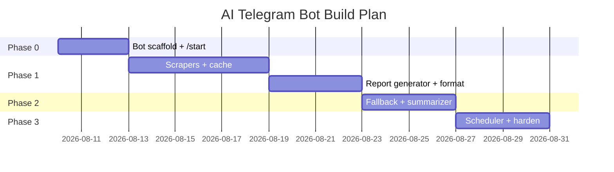
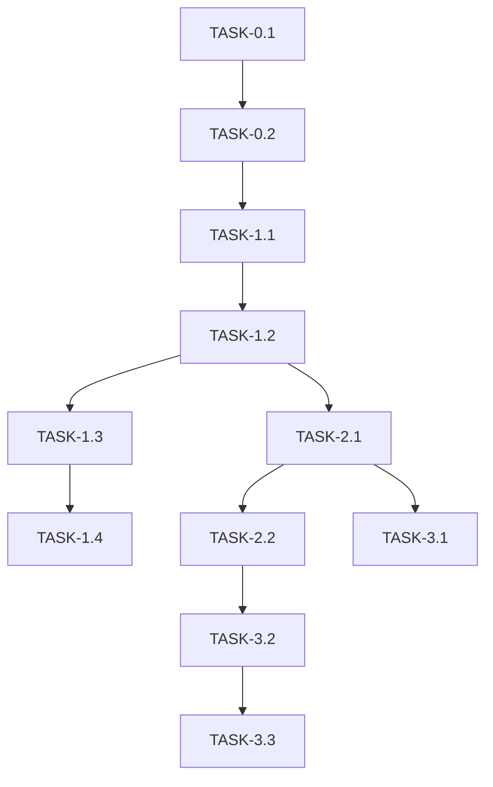

# ImplementationPlan — AI Daily Telegram Bot: Phased Build Plan

| Field | Value |
| --- | --- |
| Version | v0.1 |
| Last Updated | 2026-08-06 |
| Owner | Engineering Lead |
| Status | In Review |

---

## 1. Build Philosophy

Walking skeleton first: bot boots, one command works end-to-end. Then add sources, fallback, scheduling, and optional summarization. Reliability is layered in from the start (never serve an empty reply).

## 2. Phase Overview

## 3. Phase Breakdown

### Phase 0: Bot Scaffold
- Goal: bot boots and responds to `/start` + `/help`.
- Exit: two commands working locally.

| TASK-# | Description | Depends on | Owner | Est. | Maps to |
| --- | --- | --- | --- | --- | --- |
| TASK-0.1 | Project structure + env config | — | Eng | 1d | REQ-001 |
| TASK-0.2 | python-telegram-bot setup + `/start`, `/help` | TASK-0.1 | Eng | 2d | REQ-001 |

### Phase 1: Content Pipeline
- Goal: `/daily` produces a digest from live sources.
- Exit: digest renders with real items.

| TASK-# | Description | Depends on | Owner | Est. | Maps to |
| --- | --- | --- | --- | --- | --- |
| TASK-1.1 | Scraper framework + 6 modules (16+ sources) | TASK-0.2 | Eng | 4d | REQ-002 |
| TASK-1.2 | Cache manager (diskcache) | TASK-1.1 | Eng | 1d | REQ-003 |
| TASK-1.3 | Report generator for `/daily`, `/summary` | TASK-1.2 | Eng | 2d | REQ-001 |
| TASK-1.4 | Formatter + message splitting | TASK-1.3 | Eng | 2d | REQ-007 |

### Phase 2: Reliability & Summaries
- Goal: bot never returns empty; optional Gemini summaries.
- Exit: fallback + summarization tests pass.

| TASK-# | Description | Depends on | Owner | Est. | Maps to |
| --- | --- | --- | --- | --- | --- |
| TASK-2.1 | Curated fallback content + wiring | TASK-1.2 | Eng | 2d | REQ-004 |
| TASK-2.2 | Gemini summarizer (optional) | TASK-2.1 | Eng | 2d | REQ-005 |

### Phase 3: Scheduling & Hardening
- Goal: auto-broadcast + full command set.
- Exit: all 17 commands + scheduler verified.

| TASK-# | Description | Depends on | Owner | Est. | Maps to |
| --- | --- | --- | --- | --- | --- |
| TASK-3.1 | APScheduler broadcast | TASK-2.1 | Eng | 2d | REQ-006 |
| TASK-3.2 | Remaining commands (papers, india, compare, …) | TASK-2.2 | Eng | 2d | US-002, US-003, US-007 |
| TASK-3.3 | Retry/backoff + logging + tests | TASK-3.2 | Eng/QA | 2d | US-005, US-006 |

## 4. Dependency Graph

## 5. Environment & Tooling Setup Checklist

- [ ] `python -m venv .venv`
- [ ] `pip install -r requirements.txt`
- [ ] `.env` from `.env.example` with `TELEGRAM_BOT_TOKEN`
- [ ] Optional `TELEGRAM_CHAT_ID`, `GEMINI_API_KEY`
- [ ] `python run_bot.py` boots and replies

## 6. Rollout Strategy

- Deploy bot process (VPS/GitHub Actions scheduled runner).
- Feature-flag summarization via env (`GEMINI_API_KEY` present = on).
- Rollback: revert process image / disable scheduler env.

## 7. Definition of Done (global)

- [ ] Tests written + passing for the change
- [ ] Docs updated (this suite) if behavior changed
- [ ] Reviewed
- [ ] No secrets committed (gitleaks)
- [ ] Manual command smoke test passes

## 8. Related Documents

| Document | Relationship |
| --- | --- |
| [PRD.md](../product/PRD.md) | REQ/US mapping |
| [TechSpec.md](../technical/TechSpec.md) | Component design |
| [AppFlow.md](../design/AppFlow.md) | Flows |
| [Schema.md](../technical/Schema.md) | Cache schema |
| [Design.md](../design/Design.md) | Format tasks |
| [Tracker.md](Tracker.md) | Live status |
| [Rules.md](Rules.md) | Standards |
| [API.md](../technical/API.md) | Telegram API |
| [SecurityAndCompliance.md](../technical/SecurityAndCompliance.md) | Secrets |
| [Testing.md](../technical/Testing.md) | Test plan |
| [Deployment.md](../technical/Deployment.md) | Rollout |
| [Glossary.md](../reference/Glossary.md) | Vocabulary |
| [RiskRegister.md](RiskRegister.md) | Risks |
