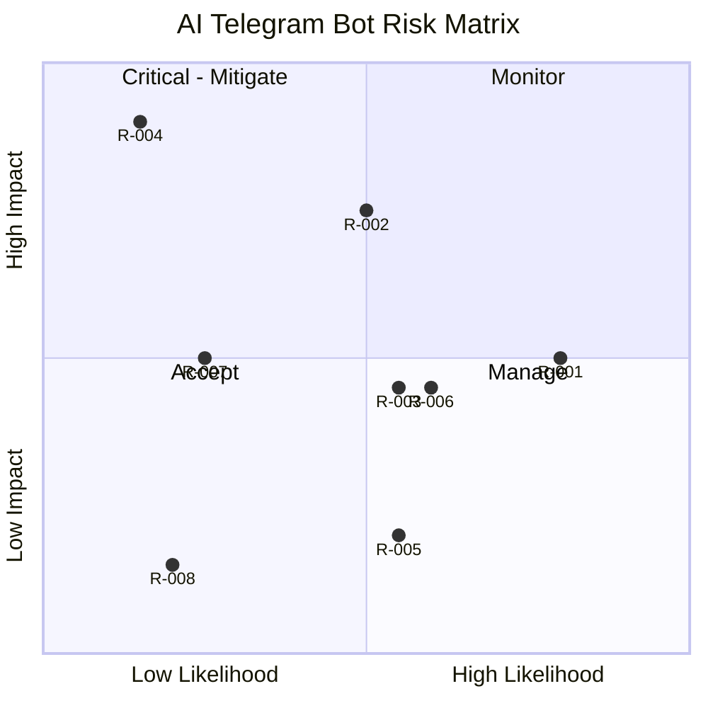

# RiskRegister — AI Daily Telegram Bot: Known Risks

| Field | Value |
| --- | --- |
| Version | v0.1 |
| Last Updated | 2026-08-06 |
| Owner | PM / Eng Lead |
| Status | In Review |

---

| Risk | Likelihood | Impact | Score | Mitigation | Owner | Status |
| --- | --- | --- | --- | --- | --- | --- |
| R-001 Source outages | High | Medium | 6 | Cache + curated fallback (REQ-004) | Eng | Mitigating |
| R-002 Oversize message crash | Medium | High | 6 | Message splitting (REQ-007) | Eng | Mitigating |
| R-003 Telegram rate-limit ban | Medium | Medium | 4 | Bounded retries, backoff | Eng | Open |
| R-004 Token leak | Low | Critical | 8 | Env-only + gitleaks + rotation | Security | Mitigating |
| R-005 Gemini quota/cost | Medium | Low | 2 | Optional, deterministic fallback | PM | Accepted |
| R-006 Scraping blocked by sources | Medium | Medium | 4 | Rotate sources, cache aggressively | Eng | Open |
| R-007 Scraped-content injection | Low | Medium | 3 | Sanitization + escape | Security | Mitigating |
| R-008 Schedule missed (no chat id) | Low | Low | 1 | Config validation + logs | Eng | Accepted |

## Risk Matrix

## Related Documents

| Document | Relationship |
| --- | --- |
| [PRD.md](../product/PRD.md) | Top-3 risks |
| [TechSpec.md](../technical/TechSpec.md) | Technical risks |
| [SecurityAndCompliance.md](../technical/SecurityAndCompliance.md) | R-004/R-007 |
| [AppFlow.md](../design/AppFlow.md) | Fallback flow |
| [Design.md](../design/Design.md) | Format |
| [Schema.md](../technical/Schema.md) | Cache |
| [ImplementationPlan.md](ImplementationPlan.md) | Mitigations |
| [Tracker.md](Tracker.md) | Risk status |
| [Rules.md](Rules.md) | Standards |
| [API.md](../technical/API.md) | R-003 |
| [Testing.md](../technical/Testing.md) | Test coverage |
| [Deployment.md](../technical/Deployment.md) | Rollback |
| [Glossary.md](../reference/Glossary.md) | Vocabulary |
