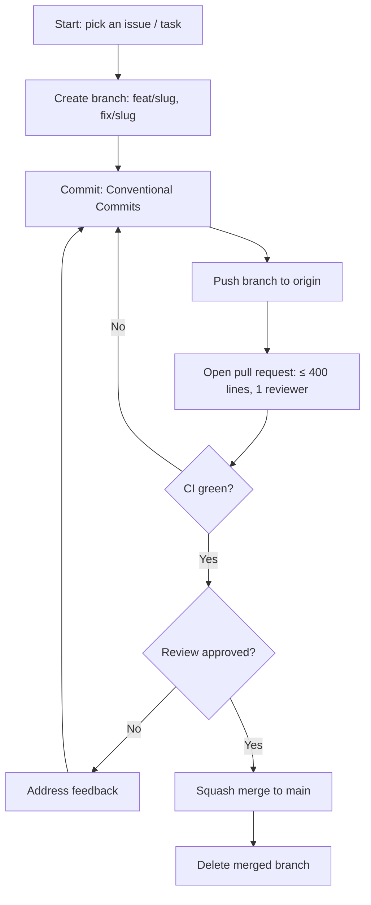

# Rules — AI Daily Telegram Bot: Coding Standards & AI-Agent Rules

| Field | Value |
| --- | --- |
| Version | v0.1 |
| Last Updated | 2026-08-06 |
| Owner | Engineering Lead |
| Status | In Review |

---

## 1. Guiding Principles

1. Reliability over features — a bot that always answers beats one with more commands.
2. Never serve empty — fallback content is mandatory.
3. Readability over cleverness.
4. Small PRs only.
5. No silent failures — every source failure is logged.
6. Secrets are env-only, always.

## 2. Code Style

- Python 3.11, type hints required.
- Formatter: black; linter: ruff; isort.
- Naming: `snake_case`.
- Structure:

```
run_bot.py            # entry point
config/               # env config, feed URLs
scrapers/             # 6 modules / 16+ sources
services/             # report_generator, scheduler, summarizer
utils/                # cache, logger, telegram formatting
```

## 3. Git Workflow

- Branches: `feat/<slug>`, `fix/<slug>`.
- Commits: Conventional Commits.
- PRs: ≤ 400 lines, 1 reviewer, CI green, gitleaks clean.
- Merge: squash to `main`.

## 4. Testing Requirements

- Minimum coverage 60% overall; scrapers' parsing helpers ≥ 80%.
- MUST have tests: message splitting, fallback selection, cache read/write, format helpers.
- See [Testing.md](../technical/Testing.md).

## 5. AI Agent Operating Rules

- Always read Tracker.md and ImplementationPlan.md before starting a task.
- Never mark a task 🟢 Done without tests passing.
- Never invent requirements not in ../product/PRD.md/../technical/TechSpec.md — flag ambiguity.
- Never commit secrets/tokens; env vars per ../technical/SecurityAndCompliance.md.
- Always preserve the fallback path — never allow an empty reply.
- When a rule conflicts with a request, state the conflict.

## 6. Security Baseline Rules

- Bot token + Gemini key from env only; gitleaks in CI.
- Validate scraped URLs (http/https only).
- No HTML injection into messages (escape/sanitize scraped text).
- Dependency scan cadence: weekly (Dependabot).

## 7. Documentation Rules

- New commands update ../design/AppFlow.md + ../product/PRD.md in the same PR.
- New env vars documented in ../technical/Deployment.md.

## 8. Prohibited Patterns

| Anti-pattern | Why |
| --- | --- |
| Committing `.env` | Token leak |
| Blanket `except` swallowing source errors | Hides outages |
| Sending raw scraped HTML | Broken formatting / injection |
| Returning empty on failure | Violates reliability principle |
| Unbounded retry loops | Telegram rate-limit bans |

## 9. Escalation Rules

**Ask a human when:** new sources need legal review, token rotation, Gemini billing changes, scope changes.
**Decide autonomously:** scraper tweaks, formatting, cache TTL tuning, log improvements.

## Git / PR Workflow



## 10. Related Documents

| Document | Relationship |
| --- | --- |
| [Testing.md](../technical/Testing.md) | Test requirements |
| [SecurityAndCompliance.md](../technical/SecurityAndCompliance.md) | Security baseline |
| [PRD.md](../product/PRD.md) | Requirements |
| [TechSpec.md](../technical/TechSpec.md) | Architecture |
| [AppFlow.md](../design/AppFlow.md) | Flows |
| [Design.md](../design/Design.md) | Format |
| [Schema.md](../technical/Schema.md) | Data |
| [ImplementationPlan.md](ImplementationPlan.md) | Tasks |
| [Tracker.md](Tracker.md) | Status |
| [API.md](../technical/API.md) | Telegram API |
| [Deployment.md](../technical/Deployment.md) | Env vars |
| [Glossary.md](../reference/Glossary.md) | Vocabulary |
| [RiskRegister.md](RiskRegister.md) | Risks |
