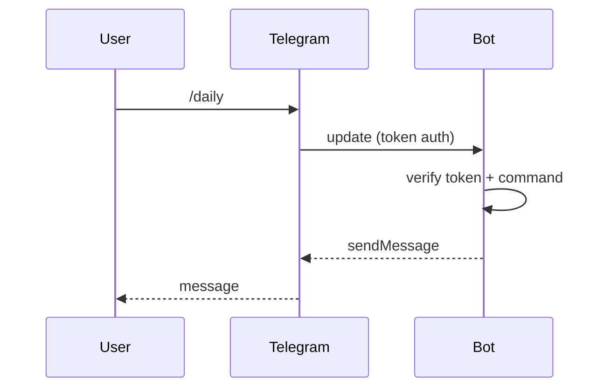

# API — AI Daily Telegram Bot: Integrations Reference

| Field | Value |
| --- | --- |
| Version | v0.1 |
| Last Updated | 2026-08-06 |
| Owner | Backend Engineer |
| Status | In Review |

---

> The bot is a client of the Telegram Bot API; it exposes no public HTTP API of its own. This file documents the Telegram API surface the bot uses (v1).

## 1. Telegram API Usage

| Method | Purpose | Auth | Notes |
| --- | --- | --- | --- |
| `getUpdates` / webhook | Receive commands | Bot token | run_bot.py polls or uses webhook |
| `sendMessage` | Deliver digests | Bot token | supports Markdown, split ≤ 4096 chars |
| `sendChatAction` | Typing indicator | Bot token | "generating…" |

## 2. Command → Handler Mapping

| Command | Handler | Response surface |
| --- | --- | --- |
| `/start` | welcome handler | SCR-001 |
| `/help` | help handler | SCR-002 |
| `/daily` | report generator | SCR-003 |
| `/summary` | summary handler | SCR-004 |
| `/news` `/papers` `/blogs` `/tools` `/jobs` `/startups` `/models` `/trending` `/learn` `/india` `/youtube` `/twitter` `/compare` | section handlers | SCR-005…017 |

## 3. Request/Response Example

**sendMessage**

```json
{
  "chat_id": 123456789,
  "text": "*AI Daily Brief* — 2026-08-06\n1. [Title](url) ...",
  "parse_mode": "Markdown"
}
```

## 4. Error Codes

| Code | Meaning | Retry? |
| --- | --- | --- |
| 400 | Bad request (e.g., oversize, bad parse_mode) | Fix formatting |
| 401 | Unauthorized (bad token) | Fix token |
| 429 | Rate limited | Yes, exponential backoff |
| 5xx | Telegram server error | Yes, bounded retry |

## 5. Versioning Policy

- Uses the stable Telegram Bot API; upgrades tracked via library version pinning.

## 6. Auth Flow



## 7. Related Documents

| Document | Relationship |
| --- | --- |
| [TechSpec.md](TechSpec.md) | Integration layer |
| [AppFlow.md](../design/AppFlow.md) | Command flows |
| [SecurityAndCompliance.md](SecurityAndCompliance.md) | Token security |
| [Schema.md](Schema.md) | Message data |
| [PRD.md](../product/PRD.md) | Command requirements |
| [Design.md](../design/Design.md) | Message format |
| [ImplementationPlan.md](../project/ImplementationPlan.md) | Tasks |
| [Tracker.md](../project/Tracker.md) | Status |
| [Rules.md](../project/Rules.md) | Standards |
| [Testing.md](Testing.md) | API tests |
| [Deployment.md](Deployment.md) | Deploy |
| [Glossary.md](../reference/Glossary.md) | Vocabulary |
| [RiskRegister.md](../project/RiskRegister.md) | Risks |
