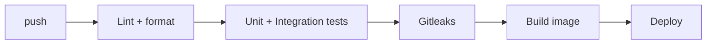

# Deployment — AI Daily Telegram Bot: Environments & CI/CD

| Field | Value |
| --- | --- |
| Version | v0.1 |
| Last Updated | 2026-08-06 |
| Owner | DevOps Engineer |
| Status | In Review |

---

## 1. Topology

| Mode | Description | When |
| --- | --- | --- |
| Local dev | `python run_bot.py` with polling | development |
| Always-on VPS/Docker | Long-running bot process + scheduler | production |
| GitHub Actions scheduled | Cron-triggered script (no long-running process) | lightweight alt |

## 2. CI/CD Pipeline

## 3. Environment Promotion

| Step | From | To | Trigger |
| --- | --- | --- | --- |
| 1 | main | staging bot | CI green |
| 2 | staging | prod bot | manual approval |

## 4. Rollback Procedure

1. Stop scheduler env (`SCHEDULER_ENABLED=false`) — instant halt of broadcasts.
2. Revert image/commit; restart process.
3. Verify command handlers respond.

## 5. Feature Flags

- `SCHEDULER_ENABLED` — broadcast on/off.
- `GEMINI_API_KEY` present — summarization on.
- `BROADCAST_INTERVAL_HOURS` — schedule cadence.

## 6. On-Call / Runbook

- **No replies:** check token validity, process up, network.
- **Broadcast missed:** verify `TELEGRAM_CHAT_ID` set, scheduler running.
- **Rate limited (429):** check retry backoff, message sizes.

## 7. Related Documents

| Document | Relationship |
| --- | --- |
| [TechSpec.md](TechSpec.md) | Components |
| [SecurityAndCompliance.md](SecurityAndCompliance.md) | Secret mgmt |
| [PRD.md](../product/PRD.md) | Release criteria |
| [AppFlow.md](../design/AppFlow.md) | Flows |
| [Schema.md](Schema.md) | Cache |
| [Design.md](../design/Design.md) | Format |
| [ImplementationPlan.md](../project/ImplementationPlan.md) | Rollout |
| [Tracker.md](../project/Tracker.md) | Status |
| [Rules.md](../project/Rules.md) | Standards |
| [API.md](API.md) | Telegram API |
| [Testing.md](Testing.md) | CI gates |
| [Glossary.md](../reference/Glossary.md) | Vocabulary |
| [RiskRegister.md](../project/RiskRegister.md) | Risks |
