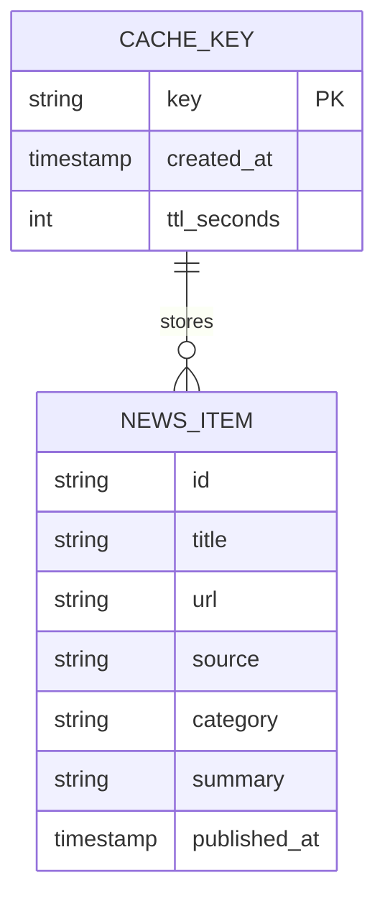

# Schema — AI Daily Telegram Bot: Data Model

| Field | Value |
| --- | --- |
| Version | v0.1 |
| Last Updated | 2026-08-06 |
| Owner | Backend Engineer |
| Status | In Review |

---

> Persistence is limited to the diskcache store (no relational DB in v1). The cache stores serialized item lists.

## 1. ER Diagram



## 2. Collection Definitions

### TBL-cache (diskcache)
| Field | Type | Nullable | Default | Constraints | Description |
| --- | --- | --- | --- | --- | --- |
| key | string PK | No | — | unique | e.g. `news:global`, `papers:arxiv` |
| value | list[NewsItem] | No | — | JSON | cached items |
| expire | timestamp | No | now()+TTL | TTL config | expiry |

### TBL-news_item
| Field | Type | Nullable | Default | Constraints | Description |
| --- | --- | --- | --- | --- | --- |
| id | string | No | — | unique | item id (url hash) |
| title | string | No | — | — | headline |
| url | string | No | — | http(s) | link |
| source | string | No | — | — | source name |
| category | string | No | — | news/papers/tools/... | section |
| summary | string | Yes | — | — | one-line summary |
| published_at | timestamp | Yes | — | — | publish time |

## 3. Relationships

Cache key holds a list of NewsItems (1:N embedded). No FK constraints (flat JSON store).

## 4. Indexes

| Table | Index | Columns | Type | Reason |
| --- | --- | --- | --- | --- |
| cache | key | key | unique | direct lookup |

## 5. Enums / Constants

| Enum | Allowed values |
| --- | --- |
| category | news, papers, blogs, tools, jobs, startups, models, trending, learn, india, youtube, twitter, compare |
| source | github-trending, arxiv, rss-*, twitter, india-*, ai-model-sites |

## 6. Data Lifecycle

- Cache TTL: configurable (default 24h); items evicted on expiry.
- No soft-delete (cache is ephemeral by design).

## 7. Migrations

N/A — schema version key (`cache_schema_version`) stored; bump invalidates stale entries.

## 8. Sample Record

```json
{
  "key": "news:global",
  "value": [
    {
      "id": "h-9f2a1c",
      "title": "New open-source model release",
      "url": "https://example.com/model",
      "source": "github-trending",
      "category": "models",
      "summary": "A new 7B model tops trending.",
      "published_at": "2026-08-05T09:00:00Z"
    }
  ],
  "expire": "2026-08-06T09:00:00Z"
}
```

## 9. Data Validation Rules

| Field | Enforced where |
| --- | --- |
| url | app layer (must be http/https, no javascript:) |
| title | app layer (strip control chars) |
| category | app layer (enum) |

## 10. Sensitive Data Map

| Field | Sensitivity | Encrypted at rest? | Masked in logs? |
| --- | --- | --- | --- |
| title/url/summary | none | no | no |
| bot token | critical | n/a (env only) | never logged |

## 11. Related Documents

| Document | Relationship |
| --- | --- |
| [TechSpec.md](TechSpec.md) | Cache manager |
| [API.md](API.md) | None (no public API) |
| [PRD.md](../product/PRD.md) | REQ-003 |
| [AppFlow.md](../design/AppFlow.md) | Cache fallback path |
| [Design.md](../design/Design.md) | Item rendering |
| [ImplementationPlan.md](../project/ImplementationPlan.md) | Tasks |
| [Tracker.md](../project/Tracker.md) | Status |
| [Rules.md](../project/Rules.md) | Standards |
| [SecurityAndCompliance.md](SecurityAndCompliance.md) | Token handling |
| [Testing.md](Testing.md) | Cache tests |
| [Deployment.md](Deployment.md) | Deploy |
| [Glossary.md](../reference/Glossary.md) | Vocabulary |
| [RiskRegister.md](../project/RiskRegister.md) | Risks |
