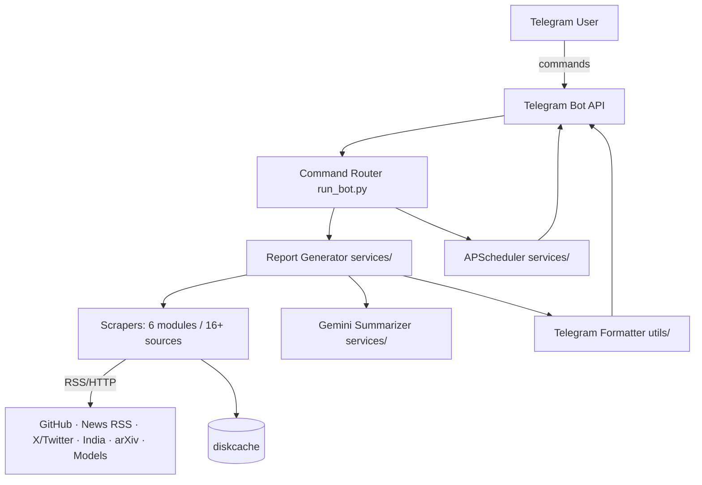
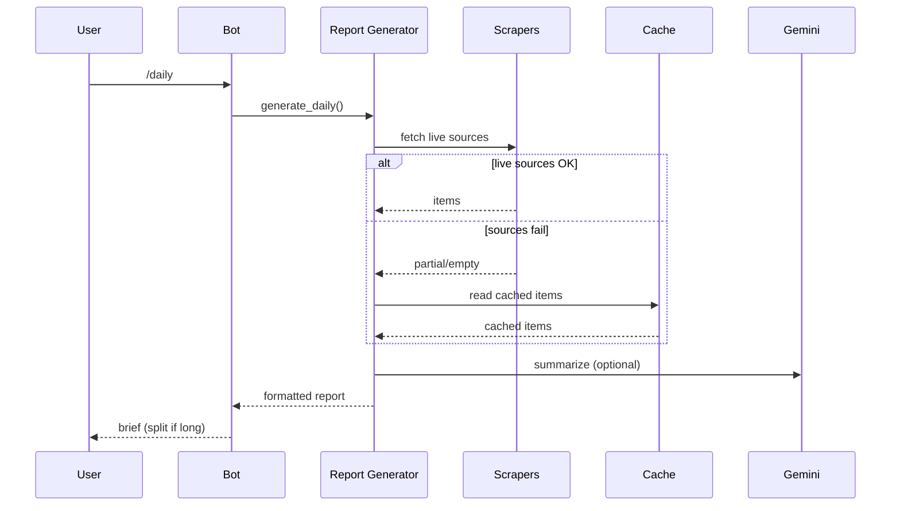
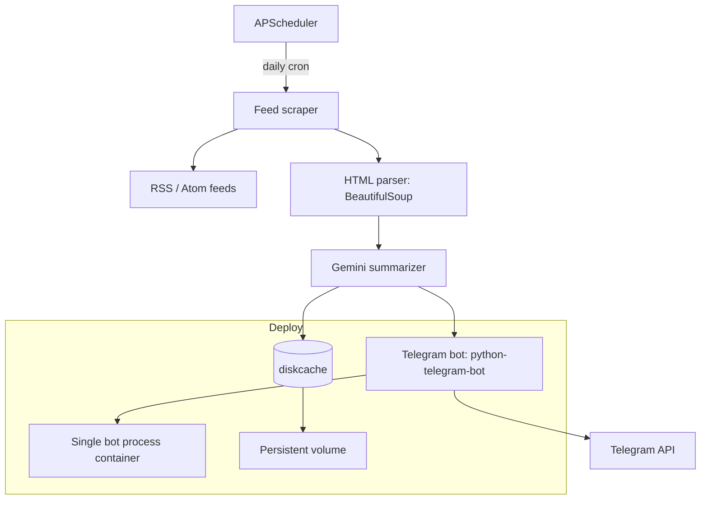
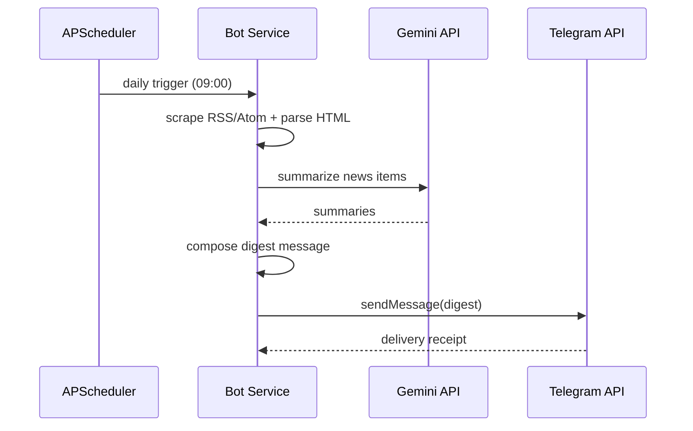

# TechSpec — AI Daily Telegram Bot: Technical Specification

| Field | Value |
| --- | --- |
| Version | v0.1 |
| Last Updated | 2026-08-06 |
| Owner | Engineering Lead |
| Status | In Review |

---

## 1. Architecture Overview

## 2. Tech Stack Table

| Layer | Technology | Version | Justification |
| --- | --- | --- | --- |
| Bot framework | python-telegram-bot | v21+ | Async, maintained, command support |
| Scheduling | APScheduler | 3.x | Cron-like intervals, in-process |
| Feed parsing | feedparser | — | RSS/Atom standard |
| HTML parsing | BeautifulSoup4 | 4.x | Scraper HTML extraction |
| HTTP | aiohttp + httpx | — | Async + sync clients |
| Summarization | Google Gemini API | optional | High-quality summaries |
| Caching | diskcache | — | Simple persistent cache, no server |
| Language | Python | 3.11 | Team stack |

## 3. System Components

| Component | Responsibility | Inputs → Outputs | Scaling | Failure Modes |
| --- | --- | --- | --- | --- |
| Command router | Parse commands, dispatch | message → handler | in-process | unknown command → help |
| Scrapers | Fetch live content | source list → items | add modules | source down → fallback |
| Cache manager | Read/write cached items | key → items | in-process | disk full |
| Report generator | Assemble digests | items → report | in-process | empty sources → curated |
| Summarizer | Condense articles | text → summary | API quota | Gemini down → skip |
| Scheduler | Broadcast on interval | cron → broadcast | in-process | chat id missing → skip |
| Formatter | Split messages | long text → parts | in-process | oversize → split |

## 4. Data Flow Diagrams

## 5. Third-Party Integrations

| Service | Purpose | Failure Fallback | Cost Model | Rate Limits |
| --- | --- | --- | --- | --- |
| Telegram Bot API | Send/receive messages | retry; split messages | Free | ~30 msg/s, per-message limits |
| Google Gemini | Summarization | skip summarization | Token-based | Quota-based |
| 16+ web sources | Content | cache → curated fallback | Free | Site-specific |

## 6. Non-Functional Requirements

| Category | Requirement | Target | How Verified |
| --- | --- | --- | --- |
| Availability | Bot responds during source outages | ≥ 95% commands succeed | Logs + tests |
| Performance | `/daily` generation time | < 30s p95 | Timing logs |
| Reliability | Scheduled broadcasts | 99% success | Scheduler logs |
| Security | Secrets (tokens) never logged | 100% | Log review |
| Observability | Per-command logs | all commands logged | Logger |

## 7. Environments

| Env | Purpose | Data | Deploy Trigger |
| --- | --- | --- | --- |
| dev | local run_bot.py | local cache | manual |
| prod | scheduled GitHub Actions or VPS | real cache | CI/manual |

## 8. Error Handling Strategy

- Source fetch failure → per-source try/except, log, fallback cache.
- Empty report → curated fallback content.
- Oversize message → split into ≤4096-char parts.
- Telegram API errors → retry with backoff (bounded).
- Gemini failure → return unsummarized digest (never block).

## 9. Observability

- Structured logs per command with source success/failure counts.
- Metrics: commands served, source failures, fallback usage, broadcast success.

## 10. Technical Risks & Mitigations

| Risk | Mitigation |
| --- | --- |
| Source block scraping | Rotate sources, cache aggressively |
| Rate limits | Per-source delays, bounded concurrency |
| Bot token leak | Env-only, never committed (see SecurityAndCompliance.md) |
| Memory growth | diskcache TTL eviction |

## Deployment Topology

## Sequence: Daily Digest Generation

## 11. Related Documents

| Document | Relationship |
| --- | --- |
| [PRD.md](../product/PRD.md) | Requirements this implements |
| [Schema.md](Schema.md) | Cache schema |
| [API.md](API.md) | Telegram API contract |
| [AppFlow.md](../design/AppFlow.md) | Flows |
| [Design.md](../design/Design.md) | Formatting |
| [ImplementationPlan.md](../project/ImplementationPlan.md) | Phases |
| [Tracker.md](../project/Tracker.md) | Status |
| [Rules.md](../project/Rules.md) | Standards |
| [SecurityAndCompliance.md](SecurityAndCompliance.md) | Secrets |
| [Testing.md](Testing.md) | Tests |
| [Deployment.md](Deployment.md) | Deploy |
| [Glossary.md](../reference/Glossary.md) | Vocabulary |
| [RiskRegister.md](../project/RiskRegister.md) | Risks |
